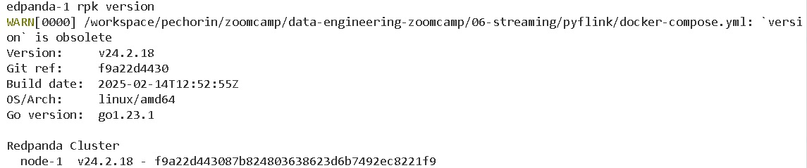
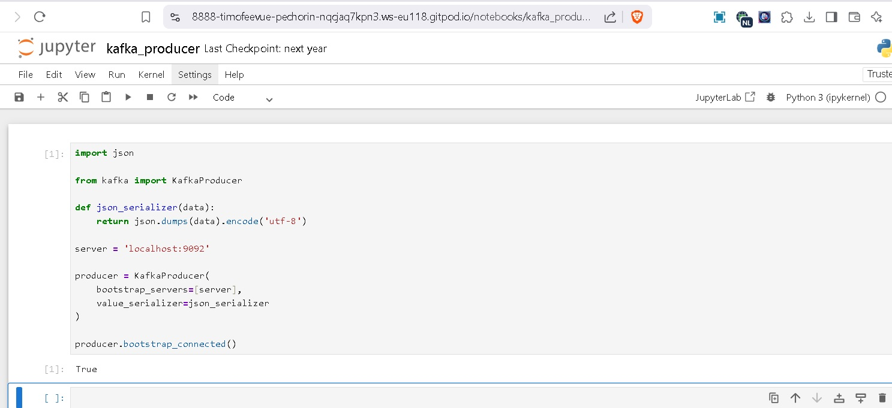

# Homework

In this homework, we're going to learn about streaming with PyFlink.

Instead of Kafka, we will use Red Panda, which is a drop-in
replacement for Kafka. It implements the same interface, 
so we can use the Kafka library for Python for communicating
with it, as well as use the Kafka connector in PyFlink.

For this homework we will be using the Taxi data:
- Green 2019-10 data from [here](https://github.com/DataTalksClub/nyc-tlc-data/releases/download/green/green_tripdata_2019-10.csv.gz)


## Setup

We need:

- Red Panda
- Flink Job Manager
- Flink Task Manager
- Postgres

It's the same setup as in the [pyflink module](../../../06-streaming/pyflink/), so go there and start docker-compose:

```bash
cd ../../../06-streaming/pyflink/
docker-compose up
```

(Add `-d` if you want to run in detached mode)

Visit http://localhost:8081 to see the Flink Job Manager

Connect to Postgres with pgcli, pg-admin, [DBeaver](https://dbeaver.io/) or any other tool.

The connection credentials are:

- Username `postgres`
- Password `postgres`
- Database `postgres`
- Host `localhost`
- Port `5432`

With pgcli, you'll need to run this to connect:

```bash
pgcli -h localhost -p 5432 -u postgres -d postgres
```

Run these query to create the Postgres landing zone for the first events and windows:

```sql 
CREATE TABLE processed_events (
    test_data INTEGER,
    event_timestamp TIMESTAMP
);

CREATE TABLE processed_events_aggregated (
    event_hour TIMESTAMP,
    test_data INTEGER,
    num_hits INTEGER 
);
```

## Solution 1: Redpanda version


> Command

```bash
docker compose exec redpanda-1 rpk help
docker compose exec redpanda-1 rpk version
```

> Screenshot



> Answer

```bash
**v24.2.18**
```

## Solution 2. Creating a topic


> Command

```bash
docker compose exec redpanda-1 rpk topic create green-trips
```

> Answer

```bash
WARN[0000] /workspace/pechorin/zoomcamp/data-engineering-zoomcamp/06-streaming/pyflink/docker-compose.yml: `version` is obsolete 
TOPIC        STATUS
green-trips  OK
```

## Solution 3. Connecting to the Kafka server


```bash
pip install kafka-python
```

You can start a jupyter notebook in your solution folder or
create a script

Let's try to connect to our server:

```python
import json

from kafka import KafkaProducer

def json_serializer(data):
    return json.dumps(data).encode('utf-8')

server = 'localhost:9092'

producer = KafkaProducer(
    bootstrap_servers=[server],
    value_serializer=json_serializer
)

producer.bootstrap_connected()
```

Provided that you can connect to the server, what's the output
of the last command?

> Screenshot



> Answer

```bash
**True**
```

## Question 4: Sending the Trip Data

Now we need to send the data to the `green-trips` topic

Read the data, and keep only these columns:

* `'lpep_pickup_datetime',`
* `'lpep_dropoff_datetime',`
* `'PULocationID',`
* `'DOLocationID',`
* `'passenger_count',`
* `'trip_distance',`
* `'tip_amount'`

Now send all the data using this code:

```python
producer.send(topic_name, value=message)
```

For each row (`message`) in the dataset. In this case, `message`
is a dictionary.

After sending all the messages, flush the data:

```python
producer.flush()
```

Use `from time import time` to see the total time 

```python
from time import time

t0 = time()

# ... your code

t1 = time()
took = t1 - t0
```

How much time did it take to send the entire dataset and flush? 
see file prod.py
```
import json
from kafka import KafkaProducer
import pandas as pd
import numpy as np
from time import time
import os
import gzip
import requests


def json_serializer(data):
    return json.dumps(data).encode('utf-8')


server = 'localhost:9092'

producer = KafkaProducer(
    bootstrap_servers=[server],
    value_serializer=json_serializer
)

if producer.bootstrap_connected():
    print("Successfully connected to Kafka!")
else:
    print("Failed to connect to Kafka.")

csv_url = "https://github.com/DataTalksClub/nyc-tlc-data/releases/download/green/green_tripdata_2019-10.csv.gz"
local_file = "green_tripdata_2019-10.csv.gz"


if not os.path.exists(local_file):
    print("Downloading the dataset...")
    response = requests.get(csv_url)
    with open(local_file, 'wb') as f:
        f.write(response.content)
    print("Dataset downloaded successfully.")


uncompressed_file = "green_tripdata_2019-10.csv"
if not os.path.exists(uncompressed_file):
    print("Decompressing the dataset...")
    with gzip.open(local_file, 'rb') as f_in:
        with open(uncompressed_file, 'wb') as f_out:
            f_out.write(f_in.read())
    print("Dataset decompressed successfully.")


print("Reading the dataset...")
df = pd.read_csv(
    uncompressed_file,
    usecols=[
        'lpep_pickup_datetime',
        'lpep_dropoff_datetime',
        'PULocationID',
        'DOLocationID',
        'passenger_count',
        'trip_distance',
        'tip_amount'
    ]
)


df = df.replace(to_replace=np.nan, value=None)

# Преобразование DataFrame в список словарей
df1 = df.to_dict(orient='records')

# Шаг 5: Отправка данных в Kafka
print("Sending data to Kafka...")
t0 = time()

for every in df1:
    producer.send('green-trips', value=every)

producer.flush()
producer.close()

t1 = time()
print(f"Data sent successfully in {(t1 - t0):.2f} seconds.")
```
> Answer

```bash
Data sent successfully in 51.30 seconds.
```

## Solution  5: Build a Sessionization Window 

Now we have the data in the Kafka stream. It's time to process it.

* Copy `aggregation_job.py` and rename it to `session_job.py`
* Have it read from `green-trips` fixing the schema
* Use a [session window](https://nightlies.apache.org/flink/flink-docs-master/docs/dev/datastream/operators/windows/) with a gap of 5 minutes
* Use `lpep_dropoff_datetime` time as your watermark with a 5 second tolerance
* Which pickup and drop off locations have the longest unbroken streak of taxi trips?

> flink job

```bash
docker compose exec jobmanager ./bin/flink run -py /opt/src/job/session2_job.py --pyFiles /opt/src/job -d
```
```bash
SELECT * FROM taxi_sessions_aggregated 
ORDER BY session_duration DESC 
LIMIT 10;
```
> Answer

```bash
75, 74
East Harlem North, East Harlem South
```

## Submitting the solutions

- Form for submitting: https://courses.datatalks.club/de-zoomcamp-2025/homework/hw6
- Deadline: See the website

